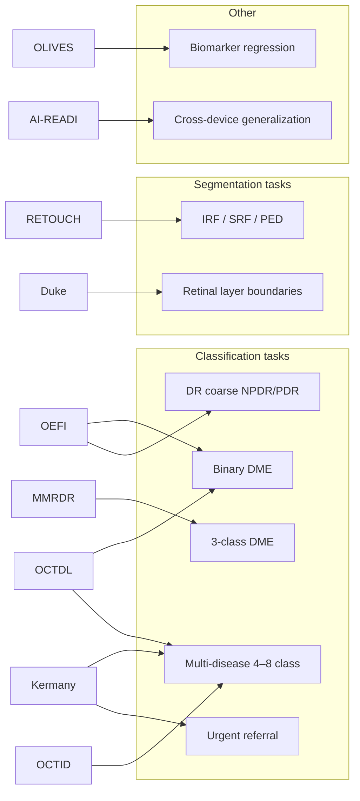

# OCT Diabetic Retinopathy — Dataset Audit

**Goal:** Understand what each public dataset contains, what diagnoses are labeled, and every meaningful way we can use them — before any model benchmarking.

**Scope:** OCT-only. Fundus integration deferred.

---

## 1. Clinical picture — what OCT tells us in DR

Diabetic retinopathy (DR) is primarily graded on **fundus** images (microaneurysms, hemorrhages, neovascularization). On **OCT**, the critical DR complication is **diabetic macular edema (DME)**:

| OCT finding | Clinical meaning |
|-------------|------------------|
| Intraretinal fluid (IRF) / cysts | Active DME |
| Subretinal fluid (SRF) | More severe macular involvement |
| Central subfield thickening | Center-involving DME → anti-VEGF treatment |
| Hard exudates, hyperreflective foci | Chronic leakage |
| DRIL (disorganized inner layers) | Poor visual prognosis |

So our OCT tasks naturally cluster around **DME detection**, **DME staging**, and **structural biomarkers** — not full 5-grade DR on OCT alone (only one dataset partially has DR labels on OCT).

---

## 2. Label types we can extract across datasets

---

## 3. Dataset-by-dataset breakdown

### Tier A — Primary (start here)

#### MMRDR (2026) — **anchor dataset**

| Field | Value |
|-------|-------|
| **OCT images** | 2,938 (2,005 patients) |
| **Format** | JPEG, `OCT.csv` + `img/` |
| **Split** | ~80/20, **patient-level** for OCT |
| **Devices** | Zeiss Cirrus HD-OCT 5000, Optovue RTVue-XR |
| **License** | CC BY-NC-ND 4.0 |

**OCT diagnosis labels (only label on OCT):**

| Grade | Name | Count | Definition |
|-------|------|-------|------------|
| 0 | No DME | 1,017 | No macular thickening or intraretinal fluid |
| 1 | NCI DME | 280 | Fluid/thickening outside central subfield |
| 2 | CI DME | 1,641 | Fluid or thickening at foveal center |

**Other fields:** `lr` (0=left, 1=right eye). No DR grade on OCT.

**Potential uses:**
- 3-class DME classification (primary task)
- Binary DME (merge grades 1+2)
- CI-DME vs rest (treatment-relevant)
- Official benchmark — compare directly to RETFound, KeepFIT, ViT numbers in the paper

**Caveats:** Heavy class imbalance (56% CI-DME). Single B-scan per eye (worst pathology slice). CFP/UWF in same dataset have DR grades but ignore for now.

---

#### OEFI — external validation set

| Field | Value |
|-------|-------|
| **OCT images** | 1,113 |
| **Source** | Multiple institutions, Mexico |
| **Files** | `OCT.csv` |

**OCT diagnosis labels:**

| Field | Values | Count (approx) |
|-------|--------|----------------|
| **DME** | 0=no, 1=yes | 946 no / 167 yes |
| **DR** | 0, `NPDR`, `PDR`, `-` (unknown) | 341 no DR / 119 NPDR / rest mixed |

**Potential uses:**
- External test for DME binary classifier trained on MMRDR
- Coarse DR classification on OCT (limited labels)
- Cross-country generalization (China MMRDR → Mexico OEFI)

**Caveats:** No 3-class DME staging. Many DR labels missing (`-`). Fundus paired but skip for now.

---

#### OCTDL (2024) — multi-disease with DME subset

| Field | Value |
|-------|-------|
| **Images** | 2,064 (821 patients) |
| **Device** | Optovue Avanti RTVue XR |
| **CSV** | `OCTDL_labels.csv` |

**Primary disease (`disease` column):**

| Class | Images | DR-relevant? |
|-------|--------|--------------|
| AMD | 1,231 | No |
| **DME** | **147** | **Yes** |
| Normal | 332 | Control |
| ERM | 155 | No |
| RVO | 101 | No |
| VID | 76 | No |
| RAO | 22 | No |

**Pathology sub-signs (`condition` column) on DME scans:**
- Intraretinal fluid (IRF)
- Hard exudates (HE)
- Hyperreflective foci
- DRIL (disorganization of inner layers)

**Potential uses:**
- DME vs 6 other diseases (7-class)
- Binary DME detection
- Fine-grained pathology classification within DME
- Combined training with OCTID/Kermany (as in OCTDL paper)

---

### Tier B — Classic benchmarks

#### Kermany / Cell 2018

| Field | Value |
|-------|-------|
| **Images** | 108,312 train (4,686 patients) + 1,000 test |
| **Classes** | CNV, **DME**, DRUSEN, NORMAL |
| **DME train** | 11,349 images |

**Potential uses:**
- Large-scale DME vs normal
- 4-class maculopathy classification
- **Urgent referral:** (CNV + DME) vs (DRUSEN + NORMAL)
- Pretraining data pool

**Caveats:** Use **v3** only (v2 had train/test leakage). Many slices per volume — must split by **patient ID** in filename. DME is one class, not staged.

---

#### OCTID

| Class | Code | ~Images |
|-------|------|---------|
| Normal | NO | 206 |
| Macular hole | MH | 102 |
| AMD | AMD | 55 |
| Central serous retinopathy | CSR | — |
| **Diabetic retinopathy** | **DR** | **107** |

**Potential uses:**
- DR vs normal (binary)
- 5-class disease classification
- Layer segmentation (25 normal with delineations)

**Caveats:** "DR" ≠ DME grading. No fluid staging. Different severity stages within DR class.

---

### Tier C — Segmentation, biomarkers, future data

| Dataset | OCT content | Labels | Best for |
|---------|-------------|--------|----------|
| **Duke DME** | 110 B-scans | 8 layer boundaries | Layer segmentation in severe DME |
| **RETOUCH** | 70 volumes | IRF, SRF, PED pixels | Fluid segmentation (AMD/RVO origin) |
| **OLIVES** | 49 OCT/eye × 96 eyes | DR/DME diagnosis + 16 biomarkers + time series | Biomarkers, treatment trajectories |
| **AI-READI** | Multi-device DICOM | T2DM cohort, retinal imaging | Cross-device DR screening (apply for access) |

---

### Tier D — General OCT (not DR-focused)

| Dataset | Images | Note |
|---------|--------|------|
| OCTMNIST | 109,309 | 4 diseases; use for pretraining only |
| Retinal OCT-C8 | 24,000 | 8 diseases; weak DR signal |

---

## 4. All potential task definitions

### Classification

| Task ID | Task | Labels | Best dataset(s) | Difficulty |
|---------|------|--------|-----------------|------------|
| **T1** | DME 3-class | No / NCI / CI | MMRDR | High (clinical standard) |
| **T2** | DME binary | No / Yes | MMRDR, OEFI, OCTDL, Kermany | Medium |
| **T3** | CI-DME detection | CI vs rest | MMRDR | Medium (imbalanced) |
| **T4** | DR on OCT (coarse) | No / NPDR / PDR | OEFI only | Low data |
| **T5** | DME vs normal | 2-class | Kermany, OCTDL subset | Easy baseline |
| **T6** | Multi-disease OCT | 4–8 classes | Kermany, OCTDL, OCTID | Standard benchmark |
| **T7** | Urgent referral | Refer vs not | Kermany | Clinical workflow |
| **T8** | Pathology signs | IRF, DRIL, HE… | OCTDL `condition` | Research |

### Segmentation (later phase)

| Task ID | Task | Dataset |
|---------|------|---------|
| **S1** | Retinal layer segmentation | Duke, OCTID (25 normal) |
| **S2** | Fluid segmentation (IRF/SRF/PED) | RETOUCH |

### Evaluation strategies

| Strategy | Description |
|----------|-------------|
| **In-distribution** | Train & test on MMRDR official split |
| **External** | Train MMRDR → test OEFI, OCTDL |
| **Cross-dataset** | Harmonize labels to binary DME (see `registry.yaml`) |
| **Patient-level** | Required for Kermany, MMRDR; never split slices randomly |

---

## 5. Label harmonization cheat sheet

When combining datasets, map to common schemas:

**→ Binary DME**

| Source | Positive (DME=1) | Negative (DME=0) |
|--------|------------------|------------------|
| MMRDR | grade 1 or 2 | grade 0 |
| OEFI | DME=1 | DME=0 |
| OCTDL | disease=DME | all other diseases |
| Kermany | folder DME | CNV, DRUSEN, NORMAL |

**→ 3-class DME:** Only MMRDR supports this natively. Do not force-map OEFI/OCTDL.

**→ DR severity on OCT:** Only OEFI (partial). MMRDR DR grades are on CFP/UWF only.

---

## 6. What to download first

| Order | Dataset | Why |
|-------|---------|-----|
| 1 | **MMRDR** | 2026 standard, 3-class DME, official splits |
| 2 | **OEFI** | External validation, binary DME |
| 3 | **OCTDL** | Multi-disease + pathology sub-labels |
| 4 | **Kermany v3** | Scale, classic baseline |
| 5 | **OCTID** | RETFound/OCTCube comparison standard |

Store under `data/raw/<dataset_name>/`. Machine-readable metadata lives in [`registry.yaml`](registry.yaml).

---

## 7. Gaps in public data (opportunities)

1. **No large OCT dataset with both DR 5-grade and DME 3-class on the same OCT scan** — MMRDR separates these across modalities.
2. **DME staging** only well-labeled in MMRDR.
3. **Fluid segmentation in DME** — RETOUCH is AMD/RVO; Duke has layers not fluid masks.
4. **3D volumes with DR labels** — most sets are single B-scans; AI-READI has volumes but needs access.

Being "the best" likely means: **win MMRDR 3-class DME** + **strong external validation on OEFI** + optionally **3D OCT** if volumes are available.

---

## 8. Next step (after this audit)

When you're ready for Phase 2:
1. Download MMRDR + OEFI
2. Run an exploratory script: class counts, image sizes, missing labels
3. Lock task **T1** (3-class DME on MMRDR) as primary benchmark
4. Then compare models against published MMRDR baselines

No benchmarking until data is on disk and explored.
